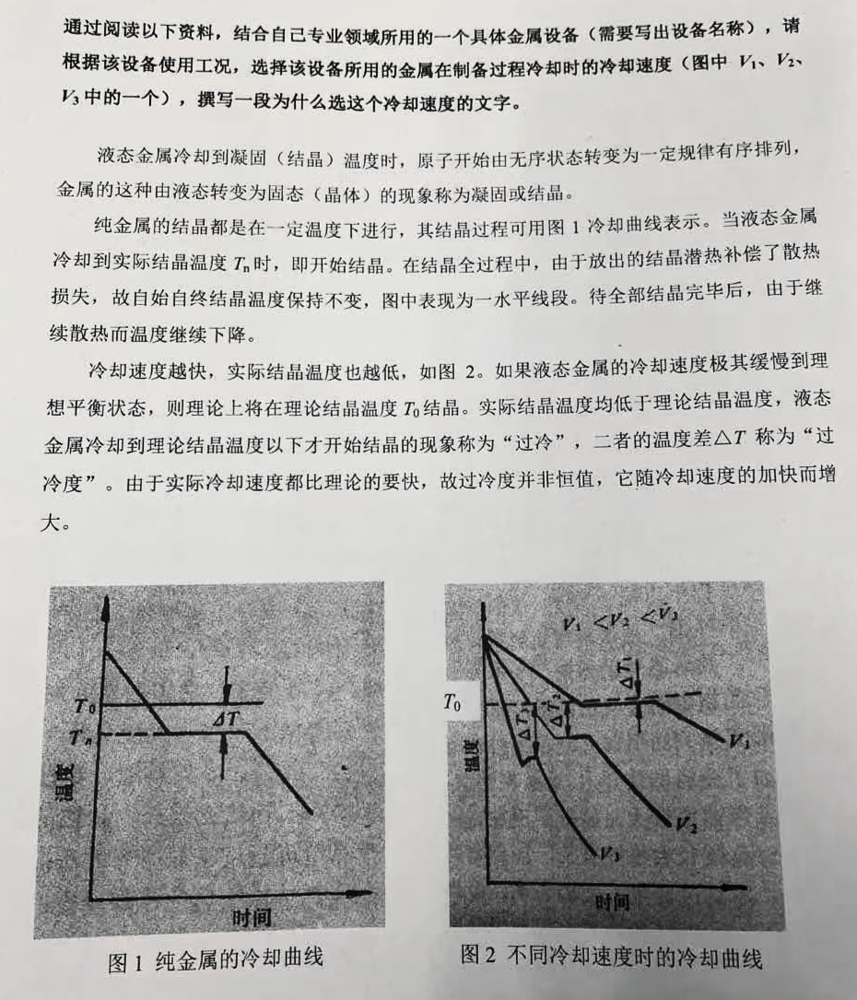
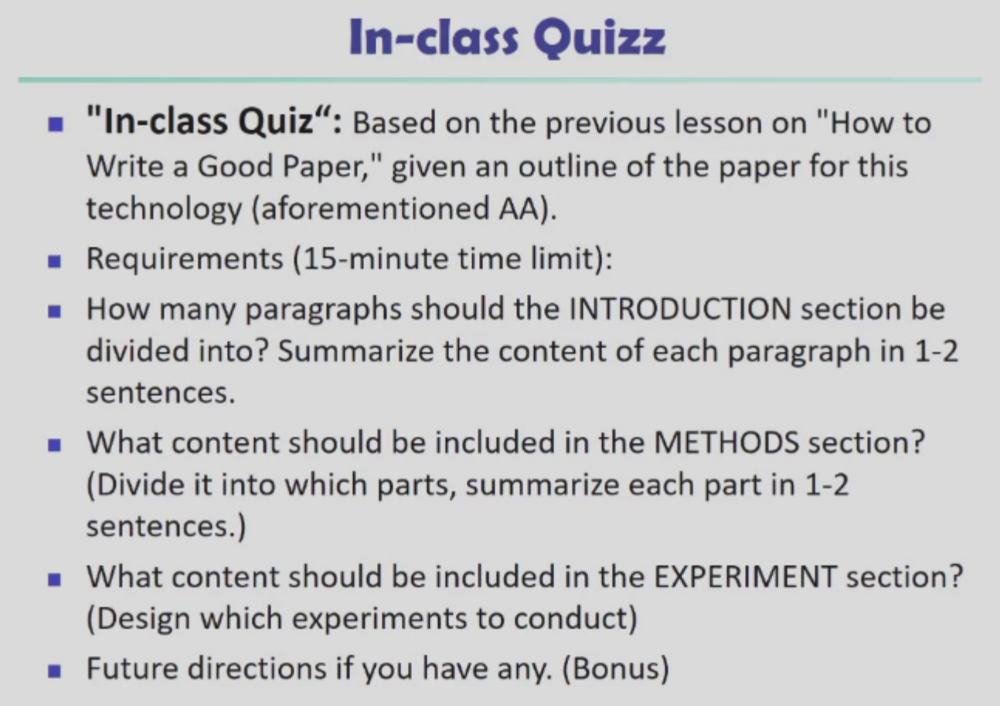
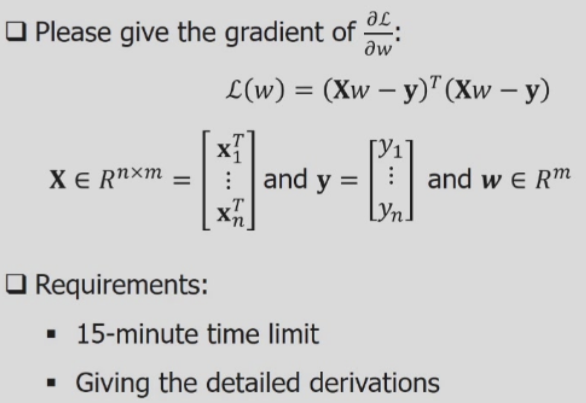

# Crazy-ZZB

## 关于培养方案

目测 ZZB 电子信息大类下各专业硕士的培养方案是一致的，belike：

| | 总学分 | 公共学位课 | 专业课 | 专业学位课 | 公共素质课 |
|-|:-:|:-:|:-:|:-:|:-:|
|最低要求| 24 | 5 | 11 | 7 | 1|

- 公共学位课（5分）为三门必修课：

    > 秋冬竞争激烈，据说春夏会好一点

    - 自然辩证法概论
    - 研究生英语应用能力提升（可免修）
    - 新时代中国特色社会主义理论与实践

- 公共选修课（ $\geq$ 1分）近似于通识，至少选一门

- 专业学位课（ $\geq$ 7分）中有两门必修：

    - 研究生论文写作指导
    - 工程伦理

- 专业选修课（ $\geq (11-X)$分），其中 $X$ 为“专业学位课”学分

    - 只要你用“专业学位课”水满 11分，你甚至可以不修
    - 是光电、计院、控院、航院的专业课大乱炖

## 关于课程

### 1 公共学位课

#### 自然辨证法概论

#### 新时代中国特色社会主义理论与实践（新中特）

24-25秋 董海樱、丁书颖

- 成绩构成：不能补缴、不能补考

    - 30% 课堂展示
    - 30% 课程论文：3k～5k字，查重率 $\lt$ 30%，参考文献 $\geq$ 5 本/篇
    - 40% 期末测试：开卷，两道综述题。下面是一些秋学期原题，目测**不同教学班的考题不一样**：

        ```
        1. 如今中国在世界经济格局中的重要性日益增强，您认为这对其他国家意味着什么？请分析潜在的作用和机会。

        2. 试用马克思注意历史观和文化观分析当代世界文化发展趋势，分析西方文化霸权主义的实际及其影响。
        ```

        ---

        ```
        1. 数字时代如何实现中华民族命运共同体

        2. 你对中国式现代化的看法和理解
        ```

- 授课形式：纯线下（部分课改班有线上课），需要分组

- Repo

    - final 给分应该比较松
        - 本人把 “对其他国家的影响” 分析成了 “对我国的影响” 也没有被叉出去
        - 跟形策一样把版面水满，缝合课本内容 + 本人分析就行

    - report 的话注意格式、标好引用，目测字数不用太卷

### 2 公共选修课

#### 公共经济学专题

24-25秋 朱柏铭（朱老师的最后一年了）

- 成绩构成：（会正态）

    - 40% 平时成绩
  
        > 互动次数与平时成绩无关

        - 随机点名，每次 -3 Pt（线下人工点名）
        - 讲解时穿插讨论，发言好有加分
        - 钉钉群里的精彩讨论会计入平时分加分

    - 60% 随堂听课心得：每次课写一份（1k左右）  
        - 于全部课程结束后 72h 内上传学在浙大
        - 不要用压缩包、不要传 PDF、不要分篇
        - 不允许复述课件内容，可以只选择一两点进行泰勒（不需要追求全面性）
  
        ```
        - 8u 说老师喜欢真情实感，可以采用“PPT摘抄 + 补充材料 + 感想”的配方
        
        - 另有 8u 结合生活经历把生活中的大小事全分析了一遍，取得高分
        ```

#### 聆听中国民族弹拨乐

24-25冬 徐添烨

- 预置要求：最好能懂 简谱 + 五线谱（不会问题也不大）

    后续可能会有识谱、唱谱的交互（但不算分）

- 成绩构成：两次 Pre + 一次考试

    - 平时：20～30min 小组 Pre，30min 左右

        选一首民族器乐的乐曲（可以是赏析 + 相关乐器的历史介绍）

    - Final：
      - 1 * 更大组的 Pre（两组合并），20min 左右

        选一首**新的**民族**管弦乐**作品进行赏析、不能是传统的五声调式

        ⚠️ 本学期有两组选题不当被骂了（不能选协奏曲），目测 《春华秋实》是比较保守的选题

      - 1 * 书面考试（开卷，三道简答选两道完成）

        是 **笔试**，各位记得带笔去，这是本学期的三道题：

        ```
        1. 我国弹拨乐器的主要特点是什么
        2. 我国琵琶曲的分类及其代表作
        3. 中国古琴的艺术本质在于
        ```

- Repo

    - 老师人还是很好的，上课不点名（也可以不请假）、只要 final 人来了就行（没来她还会私戳）

    - Pre 的时候有自己见解会被老师问名字 & 加分（应该），无情念 PPT 机器也没关系
  
#### “四史”专题

24-25冬 张立程（全程线上慕课）

- 成绩构成：

    - 75% 平时成绩

        - 30% 视频观看：说是会统计观看时长（后台并发挂一下）
        - 15% 讨论和小测

            - 小测期末截止，可以无限做（提交后出答案，题目固定）

            - 讨论看起来乱发就可以（但是每一道都要写）

        - 30% 课程论文：与四史相关，内容、字数不限

    - 25% Final：线上，三次取最高

### 3 专业学位课

#### [必修] 研究生论文写作指导

24-25秋 单国荣

- 成绩构成：

    - 20% 考勤

        缺席 -5/次、迟到早退 -2/次，$\geq$ 2 次重修

    - 80% 小测

        后三节课一次对前一周的内容进行测验，占比分别为 
        
        - 24%：选题（6%）+ 图表（18%）

            - “选题”: N 选一阐述适不适合作为专硕毕业论文。
  
                今年分四点：“不适合”、缺目标、缺方法、没体现工程性 ...
                
                总之能拆开写就拆开写

            - “图表” 相当坑：
  
                图换行悬挂、图表都没有居中、转化率（T）在温度高时较高、图例中转化率 T 要用斜体、图的画板边框没有去掉 ...

                三线表的问题应拆尽拆：上架加粗、左右去掉...

        - 36%：文字（18%）+ 参考文献（18%）

            - "文字": 给一段 sample 挑 25 个刺

                没有两端对齐（可他明明是自己在第一行敲了回车）

                序号不连续（忘记缺的 5 还是几）

            - "参考文献": 也是挑 25 个刺

                反正我对着 Google Scholar 框框一顿抄

                第一条是教材，不应该引用（但还是要找错误，belike 数字 7 用的不是 Times New Roman）

                编号不连续、标点都应该用英文的（有括号啥的）
    
        - 20%：综合撰写（20%），会有一些 *斜体*，标点（全/半角）的吹毛求疵。
    
            题干如下，目测连着两年没改。选不出器材可以写🔪，👓（反正我写的物理学圣剑）。

            

    
- 授课形式：只上四周课

- Repo

    - 目测每年题目不变 + 开卷，能找到历年卷 copy 就行
    - 但还是能不选 the Shan 就不选罢

#### [必修] 工程伦理

24-25冬 王彦君

> 助教：杨佳伦，TEL：18326678073
> 有 请假/加分 事宜去戳助教

- 成绩构成：作业不补觉、缺考不补考

    - 10% 考勤

        前三次缺课分别（-2,-3,-5），出公差/患病不扣分

    - 20% 讨论：调查、讨论 etc.（随堂/课后）
    - 70% 测试：随堂

    ```text
    后两项相比于秋学期有所改动，下面是秋学期的安排：
    - 60% 随堂：测试/作业/调研/讨论，etc.
    - 30% 考试：最后一次课，线上进行
    ```

- 授课形式：纯线下，需要分组

#### 人工智能算法与系统

24-25秋 李玺（纯线上，选哪个老师都一样）

- 成绩构成：
  
    三个 Project，需要提交 Code + Report（算法流程、实验分析、参考文献）

    1. 40% 回归算法模型
    2. 40% 基于深度神经网络的银行借贷风险预测
    3. 20% 强化学习案例

- 授课形式：

    - 网课在微信公众号上直播，Mo 平台 和 b站 会有回放
    - Project 需要在 “智海-Mo” 平台上提交

- Repo: 出分略慢，但目测直接用了平台测试分、报告可水

#### 工程前沿技术讲座

24-25秋 张薇（钉钉直播）

- 成绩构成：两次作业（两篇综述）

    - 40% Midterm（学生互评，写了就给 60 以上）
    - 60% Final（老师评阅）

- 作业（综述）要求：

    - 主题：与本课程相关
    - 内容：问题引入、方法总结、自己对该问题的理解 etc
    - 字数 $\geq$ 3k，交 PDF
 
- 授课形式：纯线上，包含钉钉/腾讯会议

### 4 专业选修课

#### 计算机视觉

24-25秋 王东辉

- 成绩构成：100% 课程报告（平时作业不计分）

    - 50% 互评 + 50% 老师给分（需要互评 50% 的同班同学，有交至少 60Pt）
    - 挑选一个 CV 技术主题进行 评论/综述，上交 PPT 和 录制的演讲视频
        - 内容可以是该主题下自己的工作进展 / 最新论文（1 or many）/ 综述 etc.
            - 论文较新 / 有生动 demo / 技术具有发展前景 时，可以适当加分
        - 视频时长 $\in [15, 30)$ min，需要本人念稿（不能有AI嘴替）
            - 可用 CN/EN，大小不超过 100MB

- Repo

    - 其实很多同学都没严格按要求来、做的也水水的，但老师给分还是挺友好的
    - 不要忘记互评、不要忘记 ddl、不要提交压缩包、不要忘记交 PPT

#### 科学计算可视化及应用开发

24-25秋 林海

- ⚠️ 会有雪灾浙大数字点名（而且不会开话筒，建议线下）

    > 但没说计不计分

- 成绩构成：

    - 20% 思考题

        ```text
        - 联系你所在学科的研究和开发实践，思考需要“可视化”的对象或过程有哪些，请举例说明；
        - 提出相应的可视化流程和可能的结果形式。
        ```

    - 30% Presentation（其他可视化 / 与自己科研课题相结合）
    - 50% Project（体绘制、面提取，会检查代码）

- 验收会安排在蒙民伟楼

#### 金融智能理论与实践

24-25冬 郑小林

- 成绩构成：
  
    > 老师说后两项的 Pre 和 Report 整合在一起（但 Report 怎么小组写啊）
    > 小组最多 2 个，最好是参考现有方法之后做一些改进（有实验）

    - 10% 平时成绩：老师说基本不点名，偶尔签到加个分
    - 20% 小组 Pre：最后一节课，对相关论文的汇报 8～10min

        Pre Report 的方向 + 一些基础方法

        可能时间不够，则自愿报名 Pre（Pre 的额外加分，没 Pre 的给基础分）

    - 70% Report：综述

```
- 后两个整合在一起？分组
- 可能的选题：LLM + 基于推荐系统进行金融营销
```

#### 医学人工智能

24-25冬 黄正行

> 本科学过的可以签表格不来听，没有研究训练

- 成绩构成：

    > 往年还有 Pre，今年选课人数太多取消了

    - 40% 平时成绩：基本会给满
    - 60% 课程报告：综述

        - 主题：医疗垂域大模型构建与应用（精神，多模态的也行）
        - 要求：
          - 探讨前沿热点、对技术深入了解
          - 参考文献多来源于外文高水平期刊及会议，至少50篇，图表至少5张
          - 中英文不限、字数不限（标准是8k，但 1k or 5k 也没问题），会查重
          - 不能重复提交其他课交过的报告

#### 数据挖掘

24-25秋 陈佳伟

- 成绩构成：

    - 60% （数据挖掘）文献综述，$\gt$ 3k words
    - 30% 2~3 * Homework
    - 10% 1~2 * Quiz

        - 写一篇 paper 的 outline（今年是 LoRA），要求如下图（限 15min，寄）：

            
            
        - 做一个矩阵求偏导的推导过程，如下图所示：

            
        
            具体解答过程如下：

            $$
            \begin{align*}
                \mathcal{L}(w) &= (Xw-y)^T(Xw-y)\\
                &=(w^TX^T-y^T)(Xw-y)\\
                &=w^TX^TXw-2y^Txw + y^Ty
            \end{align*}
            $$
            $$
            \begin{align*}
            d\mathcal{L} &= dw^TX^TXw+w^TX^TXdw-2y^TXdw\\
            &=(X^TXw)^Tdw + w^TX^TXdw - 2y^TXdw
            \end{align*}
            $$
            $$
            \frac{\partial \mathcal{L}}{\partial w} =
            2X^TXw - 2X^Ty
            $$


- 授课形式：线下

- Repo

    - 出分比较慢，但给分友好。Quiz 当点名对待就好、目测没写对也会捞捞。
    - 往年教的经典算法，今年船新升级了（但老师人很好）、塞了 DL + LLM 相关
    - 内容很有启发性：老师会讲写 paper 和出 idea 的心得、很有启发性

## 其他

### 关于住宿与通勤

- 住宿
  
  - 校区：24年部分在西溪，部分在工院至善楼
  - 条件：
      - 至善楼男女混寝，1~4F男生，5F女生（开学会开电梯）
      - [硕士] 四人寝、上床下桌、独卫（马桶）、阳台

- 通勤

    - 至善楼离善贤地铁站得有个 2km、真的远，会骑车的就骑个车吧
    - 校车班次较少（不建议西溪早八），建议群内拼车；中午 zjg 和 yq 会缺位置