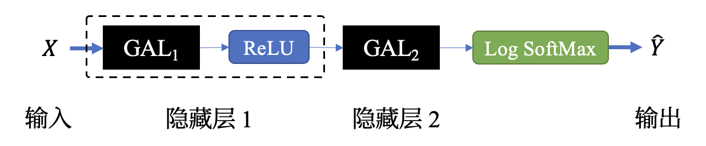
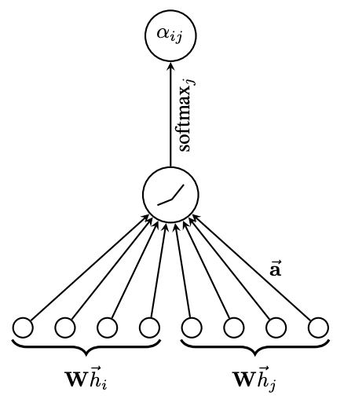

# 《金融异常检测》程序报告

<center>姓名&学号：沈韵沨，22460037</center>

<center>学院（系）&专业：工程师学院，电子信息</center>

<div style="page-break-after:always"></div>

## 1 GAT 算法流程与实现

​	在本次实验中，我们选择实现图注意力网络（Graph Attention Networks, GAT）以完成对欺诈用户的识别任务。 该算法通过引入注意力机制以弥补 GCN 无法为邻结点赋予不同权重的缺陷，从而实现更灵活的特征聚合。

​	GAT 网络由多个图注意力层（Graph Attention Layer, GAL）堆叠而成，Figure 1 展示了本词实验中使用的 GAT 分类器模型处理流程：



<center>Figure 1:  本次实验中 GAT 分类器处理流程</center>

### 1.1 图注意力层

​	图注意力层（GAL）是 GAT 网络的基本组成部分。对于具有 $N$ 个节点的图，一个输入为 $F$ 维、输出为 $F'$ 维的 GAL 层执行的操作可由 (1) 式描述：
$$
\pmb{h'} = GAL(\pmb{h})
\tag{1}
$$
其中，该层输入 $\pmb{h} = \{\vec{h_1},\vec{h_2}, ..., \vec{h_N}\} \in \mathbb{R}^F$ ，该层输出 $\pmb{h'} = \{\vec{h'_1},\vec{h'_2}, ..., \vec{h'_N}\} \in \mathbb{R}^{F'}$。

​	在该层内对编号为 $i$ 的节点进行的特征聚合过程（即 $\vec{h'_i}$ 的计算过程）可由 (2) 式描述：
$$
\vec{h'_i} = \sigma\left(
	\sum_{j\in\mathcal{N}_i} \alpha_{ij} \mathbf{W} \vec{h_j}
\right)
\tag{2}
$$
其中，$\sigma(\cdot)$ 为任意非线性激活函数，$\mathcal{N}_i$ 为节点 $i$ 的邻域集（包括其自身在内），$\alpha_{ij} \in [0,1]$ 为经归一化后节点 $j$ 对于节点 $i$ 的注意力权重，$\mathbf{W} \in \mathbb{R}^{F' \times F}$ 为该层的权重矩阵。

​	对归一化注意力权重 $\alpha_{ij}$ 的具体计算过程如 Figure 2 所示。记原始注意力权重为 $e_{ij}$，则有：
$$
e_{ij} = a\left(
	\mathbf{W} \vec{h_i}, \mathbf{W} \vec{h_j}
\right)
\tag{3}
$$
其中，自注意力机制 $a(\cdot): \mathbb{R}^{F'} \times \mathbb{R}^{F'} \rightarrow \mathbb{R}$。

​	在 [1] 中，作者采用参数为 $\pmb{\vec{a}} \in \mathbb{R}^{2F'}$的单层前馈神经网络实现注意力机制 $a(\cdot)$，并采用负值斜率 $\alpha=0.2$ 的 LeakyReLU 函数进行非线性激活。因此，我们可将 (3) 式改写如下：
$$
e_{ij} = \text{LeakyReLU}\left(
	\pmb{\vec{a}}^T \text{concat}\left(
		\mathbf{W} \vec{h_i}, \mathbf{W} \vec{h_j}
\right)
\right)
\tag{4}
$$
​	随后经由 Softmax 归一化即可得到最终的 $\alpha_{ij}$：
$$
\alpha_{ij} = \mathop{\text{Softmax}}_{j\in\mathcal{N}_i}(e_{ij})
\tag{5}
$$




<center>Figure 2:  归一化注意力权重计算<sup>[1]</sup></center>

### 1.2 多头注意力机制

​	为进一步提升模型的表征能力与泛化能力，我们通常会引入多头注意力机制（Multi Head Attention）。当采用 $K$ 头注意力机制时，作者在 [1] 中提出了两种聚合操作：拼接（如式 6 所示）和平均（如式 7 所示）。
$$
\vec{h'_i} = \mathop{||}_{k=1}^K \sigma\left(
	\sum_{j\in\mathcal{N}_i} \alpha_{ij}^k \mathbf{W}^k \vec{h_j}
\right)
\tag{6}
$$
其中，$||$ 为拼接（concat）操作，$\alpha_{ij}^k$ 为第 $k$ 个注意力头计算得到的归一化注意力值，$\mathbf{W}^k$ 为第 $k$ 个注意力头的权重参数。此时，$\vec{h'_i}$ 将包含 $KF'$ 个特征（而非式 2 中的 $F'$ 个）。
$$
\vec{h'_i} = \sigma\left(
	\frac{1}{K}
	\sum_{k=1}^K\sum_{j\in\mathcal{N}_i} \alpha_{ij}^k \mathbf{W}^k \vec{h_j}
\right)
\tag{7}
$$

### 1.3 Mask Graph Attention

​	GAT 网络中的注意力权重可通过两种方式计算得到：

1. Global Graph Attention：计算结点 $i$ 与图中全部 $N$ 个结点间的注意力权重。

   这种方式完全忽视了图的固有结构（结点间的联通性），且将导致高昂的计算成本。

2. Mask Graph Attention：仅计算结点 $i$ 与其领域 $\mathcal{N}_i$ 中结点间的注意力权重。

   考虑到大多数图都是稀疏的，该方式将显著降低计算成本。

​	本次实验中通过向图注意力层传递结点间的邻接关系，实现对 Mask Graph Attention 的计算。

### 1.4 实现

#### 1.4.1 数据预处理

​	采用和 Sample 中相同的数据预处理流程，具体操作包括：将有向图转换为无向图、标准化特征值、划分训练/测试/验证集。

```python
from utils import DGraphFin
import torch_geometric.transforms as T

def preprocessData(path='./datasets/', dataset_name='DGraph'):
	# load DataSet
	data = GraphFin(root=path, name=dataset_name, transform=T.ToSparseTensor())[0]
  
	data.adj_t = data.adj_t.to_symmetric()             # 有向图 -> 无向图
	data.x = (data.x - data.x.mean(0)) / data.x.std(0) # 标准化特征
	data.y = data.y.squeeze(1)
	split_idx = {                                      # 划分数据集
		'train': data.train_mask, 
		'valid': data.valid_mask, 
		'test':  data.test_mask
	}
  
	return data, split_idx
```

#### 1.4.2 模型搭建

​	由于 `torch_geometric` 中已经实现了 `GATConv` 层，因此GAT 网络的搭建较为便捷。在本次实验中，我们搭建了简单的双层 GAT 网络。

​	参照 [1] 中的实验，我们选用 ReLU 函数作为 $\sigma$，在第一个 GAL 层中使用 *拼接* 操作聚合多头注意力、第二个 GAL 层中使用 *平均* 操作进行聚合：

```python
from torch_geometric.nn import GATConv
import torch.nn.functional as F

class GAT(torch.nn.Module):
	def __init__(self,
		in_size, hidden_size, out_size=2, n_heads=[]
	):
		super(GAT, self).__init__()
    # 首个 GAL 层，采用 concat 操作
		self.conv1 = GATConv(
			in_channels=in_size, out_channels=hidden_size,
			heads=n_heads[0], 
			concat=True
		)
    # 第二个 GAL 层，采用 average 操作
		self.conv2 = GATConv(
			in_channels=hidden_size*n_heads[0], out_channels=out_size,
			heads=n_heads[1], 
			concat=True
		)

	def reset(self):
		self.conv1.reset_parameters()
		self.conv2.reset_parameters()
      
	def forward(self, x, edge_index):
		hidden = F.relu(              # 采用 ReLU 进行层间激活
			self.conv1(x, edge_index)
		)
		preds = self.conv2(hidden, edge_index)
    
		return preds.log_softmax(dim=-1)
```

<div style="page-break-after:always"></div>

## 2 实验分析

### 2.1 评估指标

​	为与作业要求保持一致，本次实验采用 AUC 作为评估指标。

### 2.2 参数设置

- GAT 网络
  - `in_size`: 20，`hidden_size`: 128，`out_size`: 2
  - 两个 GAL 层的注意力头数分别为 `4, 1`
- 优化器 Adam
  - 初始学习率：0.003
  - L2 正则化项：0.000005

​	最终跑了 200 个 Epoch，（因为配不好 GPU 脚本）CPU 快干冒烟了。没把每个 Epoch 的 NLL Loss 和 AUC 记下来，这边只能贴一下 log：

```text
Epoch: 10, Loss: 0.0631, Train: 75.903%, Valid: 74.080% 
Epoch: 20, Loss: 0.0629, Train: 76.070%, Valid: 74.288% 
Epoch: 30, Loss: 0.0628, Train: 76.218%, Valid: 74.229% 
Epoch: 40, Loss: 0.0628, Train: 76.270%, Valid: 74.283% 
Epoch: 50, Loss: 0.0626, Train: 76.763%, Valid: 74.308% 
Epoch: 60, Loss: 0.0628, Train: 74.890%, Valid: 72.771% 
Epoch: 70, Loss: 0.0626, Train: 76.636%, Valid: 74.526% 
Epoch: 80, Loss: 0.0626, Train: 76.672%, Valid: 74.636% 
Epoch: 90, Loss: 0.0626, Train: 76.640%, Valid: 74.530% 
Epoch: 100, Loss: 0.0626, Train: 76.199%, Valid: 74.421% 
Epoch: 110, Loss: 0.0627, Train: 76.541%, Valid: 74.478% 
Epoch: 120, Loss: 0.0626, Train: 76.771%, Valid: 74.425% 
Epoch: 130, Loss: 0.0626, Train: 76.548%, Valid: 74.508% 
Epoch: 140, Loss: 0.0627, Train: 76.689%, Valid: 74.588% 
Epoch: 150, Loss: 0.0625, Train: 76.715%, Valid: 74.823% 
Epoch: 160, Loss: 0.0626, Train: 76.280%, Valid: 74.499% 
Epoch: 170, Loss: 0.0626, Train: 76.818%, Valid: 74.687% 
Epoch: 180, Loss: 0.0625, Train: 76.617%, Valid: 74.249% 
Epoch: 190, Loss: 0.0625, Train: 76.632%, Valid: 74.562% 
Epoch: 200, Loss: 0.0625, Train: 74.697%, Valid: 73.012% 
```

### 2.3 改进

​	Brody S 等人在 [2] 中指出了 GAT 网络的局限性：

​	将 (4) 式中的 $\pmb{\vec{a}} \in \mathbb{R}^{2F'}$ 分解为 $[\pmb{\vec{a_1}}][\pmb{\vec{a_2}}] \in \mathbb{R}^{2F'}$，该式可被改写为：
$$
e_{ij} = \text{LeakyReLU}\left(
		\pmb{\vec{a_1}}^T \mathbf{W} \vec{h_i} +  \pmb{\vec{a_2}}^T \mathbf{W} \vec{h_j}
\right)
\tag{8}
$$
​	由于 LeakyReLU 与 Softmax 均为单调函数，只要 $\pmb{\vec{a_1}}^T \mathbf{W} \vec{h_i} +  \pmb{\vec{a_2}}^T \mathbf{W} \vec{h_j}$ 取得 Max 值，$\alpha_{ij}$ 也将取得 Max 值。

​	对于完全二分图（Complete Bipartite Graph），其顶点集 $\mathcal{V} = \{v_1, v_2, ... , v_N\}$ 中的结点个数是有限的。设存在 $j_{max} \in \mathcal{V}$ 使得 $\pmb{\vec{a_2}}^T \mathbf{W} \vec{h_j}$ 取得最大值，则对于任何 query 结点 $i$，$\alpha_{ij_{max}}$ 均为其注意力权重分布 $\{\alpha_{ij}\}$ 上的最大值。

---

​	Brody S 等人通过修改注意力权重的计算顺序巧妙的解决了这个问题：将 $\pmb{\vec{a}}$ 移动至非线性激活函数外，以避免  $(\pmb{\vec{a}}, \mathbf{W})$  坍缩至单层线性层。在 GATv2 中，$e_{ij}$ 的计算过程被修改为：
$$
e_{ij} = \pmb{\vec{a}}^T \text{LeakyReLU}\left(\mathbf{W} [\vec{h_i} \| \vec{h_j}]
\right)
\tag{9}
$$

> `torch_geometric.nn` 中同样提供了 `GATv2Conv` 的相关实现，但感觉 CPU 快寄了就不跑了。

<div style="page-break-after:always"></div>

## 参考文献

[1] Veličković P, Cucurull G, Casanova A, et al. Graph attention networks[J]. arXiv preprint arXiv:1710.10903, 2017.

[2] Brody S, Alon U, Yahav E. How attentive are graph attention networks?[J]. arXiv preprint arXiv:2105.14491, 2021.