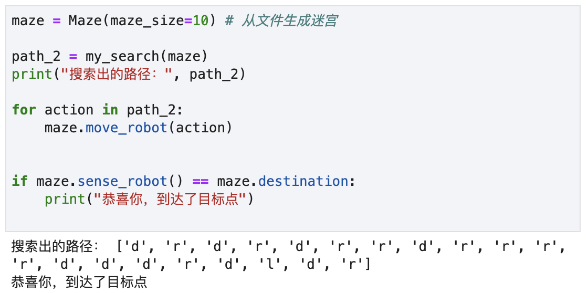
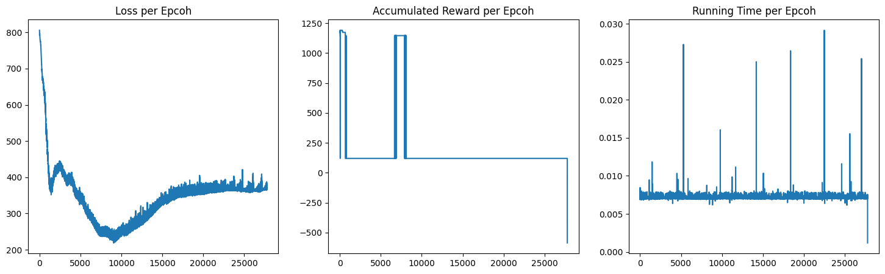
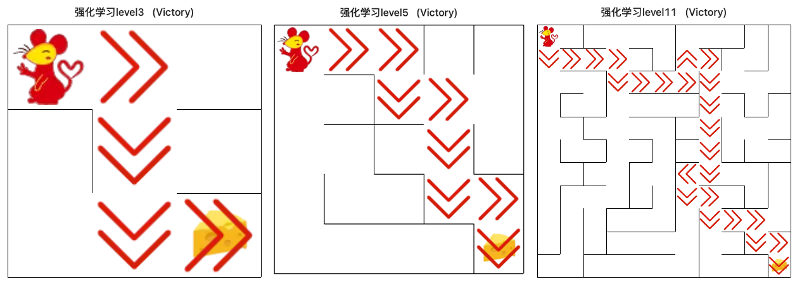
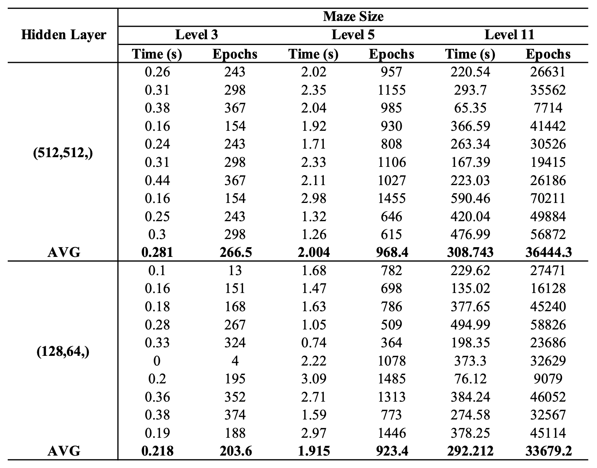

# 《机器人自动走迷宫》程序报告

姓名&学号：沈韵沨，22460037

学院（系）&专业：工程师学院，电子信息

## 1 基础搜索算法（深度优先）

​	在本次实验中，我们选择了深度优先搜索算法（BFS），主要通过 递归调用函数 + 栈（实际实现中为 `List`）实现搜索和回溯。

### 1.1 算法流程

- 初始化：记机器人在迷宫中的初始位置为当前位置（`cur_pos`）、初始化一个空栈（`path`）用于记录机器人的行走路径（方向）

- 递归执行以下 DFS 操作，直至符合终止条件（到达迷宫终点）：

  1. 若机器人到达终点：**终止递归**、返回完整路径

  2. 若机器人尚未到达终点：

     1. 检查当前位置下可前进的方向，并从中移除折返至上一途径点的选项。

     2. 若无可选前进方向：从栈中弹出最终行走方向，**回溯** 至上一状态。

     3. 若存在可选前进方向：

        顺序向栈中压入行走方向、更新当前位置，并对该方向继续进行 DFS 操作；

        若所有可选方向均无法到达终点，则从栈中弹出最终行走方向，**回溯** 至上一状态。

### 1.2 实验与小结

​	如 Figure 1 所示，我们实现的 DFS 算法确实能走出迷宫（鉴于算法的枚举本质，这并不奇怪）。

Figure 1: DFS 算法测试结果（maze_size = 10）

​	实际上本流程仍存在漏洞：由于默认迷宫中不存在环路，本流程未采用矩阵记录 `visited` 信息 —— 在某些情形下，该流程将导致死循环。

​	显然，此漏洞可以通过添加一个 $N \times N$ 矩阵用以记录 `visited` 信息、并在访问/回溯操作中进行合理维护予以修复。但鉴于该版本已成功苟过验收环节，此处暂且略过。	

## 2 Deep Learning 算法

### 2.1 算法简介

​	在本节中，我们基于如 Figure 2 所示的算法框架图简述 DQN[1] 算法流程。

​	

Figure 2: DQN 算法框架图（引自实验文档）

- **初始化**：随机初始化具有相同结构的 *在线网络*（`eval_nn`）和 *目标网络*（`target_nn`）、创建用于存放历史探索经验的 *经验池*（`replayDataSet`）。

- 对于训练的每一个 Step：

  1. **探索-利用**：基于 epsilon-greedy 算法随机选择动作，并线性减小 epsilon 直至到达阈值。

  2. **交互-存储**：智能体以选定的动作与环境进行交互，并获取奖励反馈与新的状态；随后将新的训练数据存储至 *经验池* 中。

  3. **学习**：从 *经验池* 中随机采样一批训练数据 $\{Record_i\}_{1\leq i \leq batch\_size}$，并训练 *在线网络*。其中，需要最小化的损失为：
     $$
     \frac{1}{batch\_size} \sum_{i=1}^{batch\_size}[\hat{Q}(s_i,a_i) - (r_i + \gamma * \max_a{Q'(s_i',a_i')})]^2
     $$
     

     其中，$\hat{Q}(\cdot)$ 为 *在线网络* 预测值，$Q'(\cdot)$ 为 *目标网络* 预测值。

  4. **同步更新**：（每 Step 个间隔执行一次 ）将 *在线网络* 的参数完全复制给 *目标网络*

### 2.2 算法实现

​	在本次实验中，我们参照 `class MinDQNRobot`（Pytorch version） ，继承 `class QRobot` 实现了自己的 DQNRobot —— `class Robot()`。该类包含以下主要方法：

- `_build_nn()`：基于 `class QNetwork` 初始化 *在线网络* & *目标网络*、初始化用于训练  *在线网络*  的 Adam 优化器。

  > return:  `None`

- `_update_target_nn()`：将 *在线网络*  中的参数更新同步至 *目标网络*。

  > return:  `None`

- `_choose_action(state)`：根据  epsilon-greedy 策略策略接下来需要执行的动作。

  > return:  `action`，智能体下一步将执行的动作，如 `'u'`。

  记生成的随机数为 `rand`，有：

  - 若 `rand < epsilon` ，则随机在 "上-下-左-右" 中选择一个动作返回。

  - 若 `rand >= epsilon`，则使用 *在线网络* 预测当前状态下各动作的 Q值，并从中选择具有 **最大Q值** 的动作返回。

    > 由于在编码实现中，我们采用了与 `class MinDQNRobot` 类似的奖励策略，此处实际选择的是具有 **最小Q值** 的动作。

- `learn(batch_size)`：从 *经验池* 中随机采样指定大小的样本集，以训练 *在线网络* 并更新其权重参数。

  > return:  `loss_val`，本次训练产生的（均方误差）损失，如 `190.24`。

  1. 从 *经验池* 中随机采样 `batch_size` 条训练数据

  2. 使用 *目标网络* 预测所有训练数据中*下一状态* 的 Q值 $Q'(state',action')$

  3. 基于以下公式计算所有训练数据 *当前状态* 下 Q值 的 真实值 $Q(state,action)$
     $$
     Q(state,action) = reward + \gamma * \max_{action}Q'(state',action')
     $$

  4. 使用 *在线网络* 预测所有数据中 *当前状态* 下 Q值 的 预测值  $\hat{Q}(state,action)$。即：
     $$
     \hat{Q}(state,action) = \text{EvalNN}(state)
     $$

  5. 记 `batch_size = N`，则本次训练的总损失为：
     $$
     Loss = \frac{1}{N}\sum_{i=1}^{N}(\hat{Q}(state,action) - Q(state,action))^2
     $$

- `train_update()`：使用 *在线网络* 选择动作进行探索，并每隔一段时间将更新同步至 *目标网络*。

  > return:  `action, reward`，选择的动作及其执行后的奖励，如 `'u', 1.`

  1. 使用 *在线网络* 预测当前状态下各动作的 Q值，并选择其中具有 **最大Q值** 的动作执行
  2. 计算执行动作后产生的新状态并考虑是否走出迷宫、将这些信息作为一条新的训练数据插入 *经验池*
  3. 训练 *在线网络*
  4. 迭代步数计数器、线性递减 `epsilon`
  5. 每隔 `updateInterval` 步将 *在线网络* 的参数变化同步给 *目标网络*

- `test_update()`：使用 *在线网络* 选择动作，并返回该动作及其奖励。

  > return:  `action, reward`，选择的动作及其执行后的奖励，如 `'r', 10.`

### 2.3 实验与分析

#### 2.3.1 参数设置

- 奖励函数

   	参考 `MinDQNRobot` 中的实现，本次实验将 撞墙/正常移动 两种奖励设置为正值、将 抵达终点 的奖励设置为负值；

  ​	此外，由于在规模较大的迷宫中案例设置的定值 `-50.` 无法给予走出迷宫的智能体足量的正向反馈，导致智能体无法正确寻得出路。故此处将 抵达终点 的奖励值设置为 $\propto$ `maze_size`2 的负值，以实现对不同大小迷宫的自适应。

  ​	本次实验最终采用的奖励函数如下：
  $$
  reward = 
  \left\{
  \begin{align*}
  \text{hit wall} &= 10,\\
  \text{destination} &= -5 * \text{maze\_size}^2,\\
  \text{default} &= 1
  \end{align*} 
  \right.
  $$

- 神经网络与优化器

  ​	与实例中采用了同样的全连接神经网络，两个隐藏层各含 512 个神经元、采用 ReLU 函数进行激活。

  ​	Adam 优化器初始学习率设置为 `0.001`。

- 其他

  ​	与 sample 中类似，本次实验通过 `ReplayDataSet` 类提供的 `build_full_view()` 提前将所有可能的训练数据插入经验池中。

  ​	每次训练都使用完整的 memory 进行，即 $\text{batch\_size} = (\text{maze\_size}^2-1)*4$。慢是真的慢，但反正能练出来。

  ​	由于模型练成需要较多的 Epoch，但 OJ 上给的实在太少了——于是悄悄在构造函数里先把自己练成了。

#### 2.3.2 实验验证

​	Figure 3 是本实验实现的 DQNRobot 在某次探索大小为 11 的迷宫时的相关训练数据。从中不难看出：随着 Epoch 的增加，模型的损失逐渐趋于稳定，且累计奖励值逐渐下降，符合对 `MinRobot` 的训练预期。

Figure 3:  DQNRobot 在某次探索 maze_size=11 迷宫时的训练数据

​	如 Figure 4 所示，在本次实验中实现的 DQNRobot 在 `maze_size = 3,5,11`  时均能成功通过测试。下面将对其性能作简要分析：

Figure 4:  DQNRobot 测试结果

​	如 Table 1 所示，采用默认隐藏层大小 `(512, 512,)` 的 DQNRobot 在首次通过不同大小的迷宫时所需时间与 Epoch 数量均大于隐藏层大小为 `(128, 64,)` 的 DQNRobot，且两者之间的差距随迷宫规模增大显著上升。

​	因此，我们可以尝试通过适当删除不必要的隐藏层节点以在保持模型非线性映射能力的同时，降低训练模型所需的时间成本与计算成本。

Table 1:  采用不同隐藏层大小时，DQNRobot 成功寻得迷宫出口所需时间与 Epoch 数

## 参考文献

[1] Mnih V. Playing atari with deep reinforcement learning[J]. arXiv preprint arXiv:1312.5602, 2013.

[2] 缙云山车神. 深度Q网络（Deep Q Network, DQN）原理&实现. https://www.cnblogs.com/xoslh/p/17609512.html

[3] Adam Paske. Reinforcement Learning (DQN) Tutorial. https://pytorch.org/tutorials/intermediate/reinforcement_q_learning.html