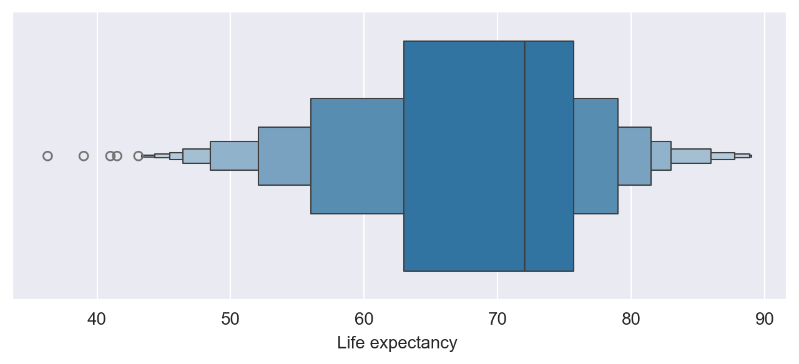
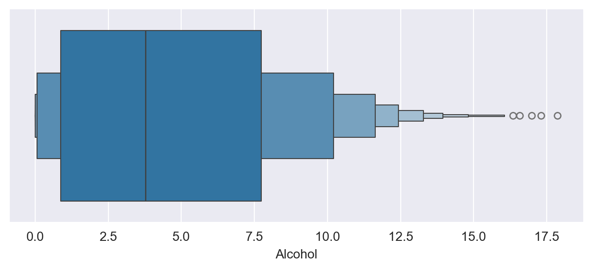
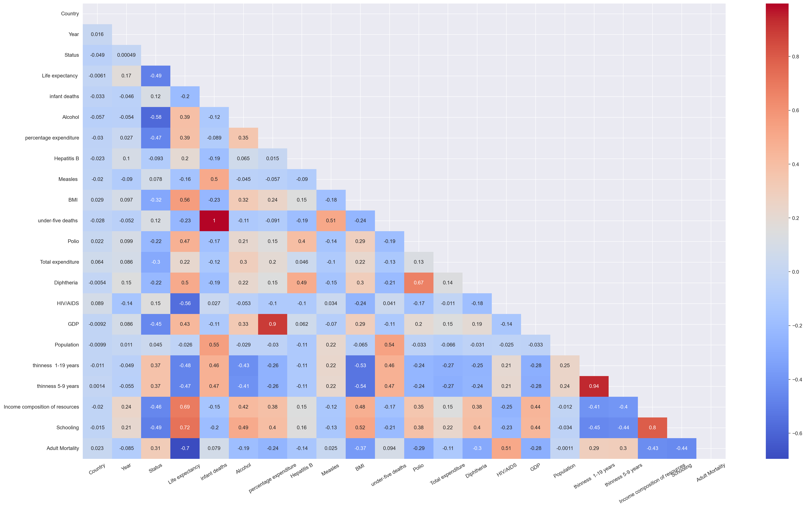
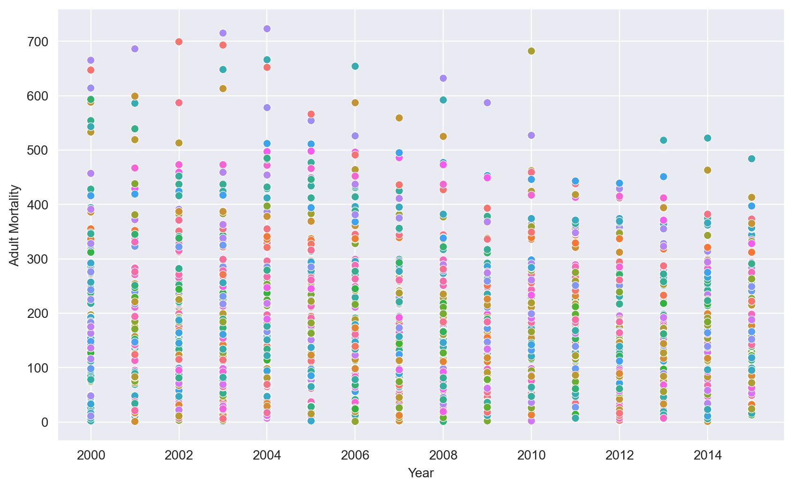
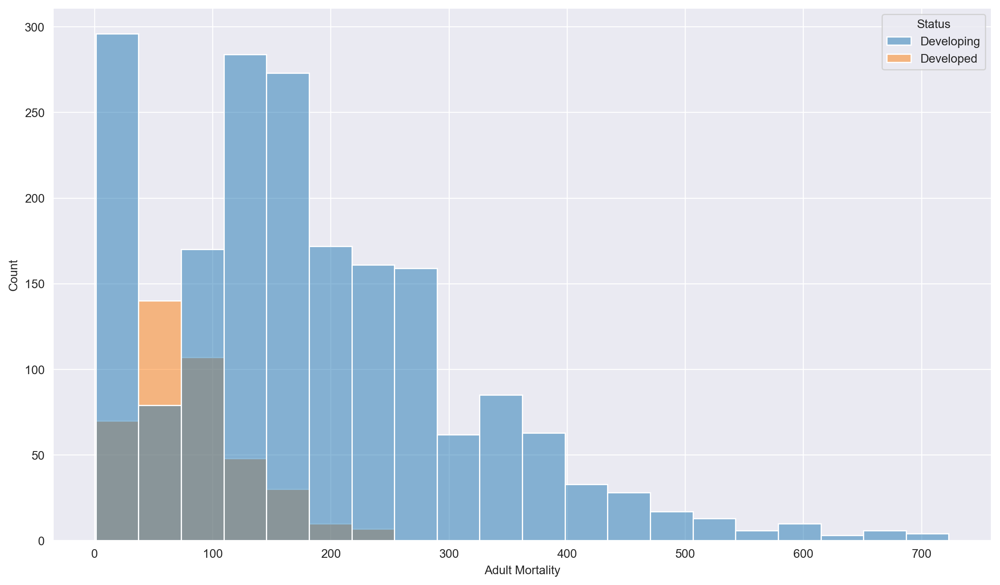
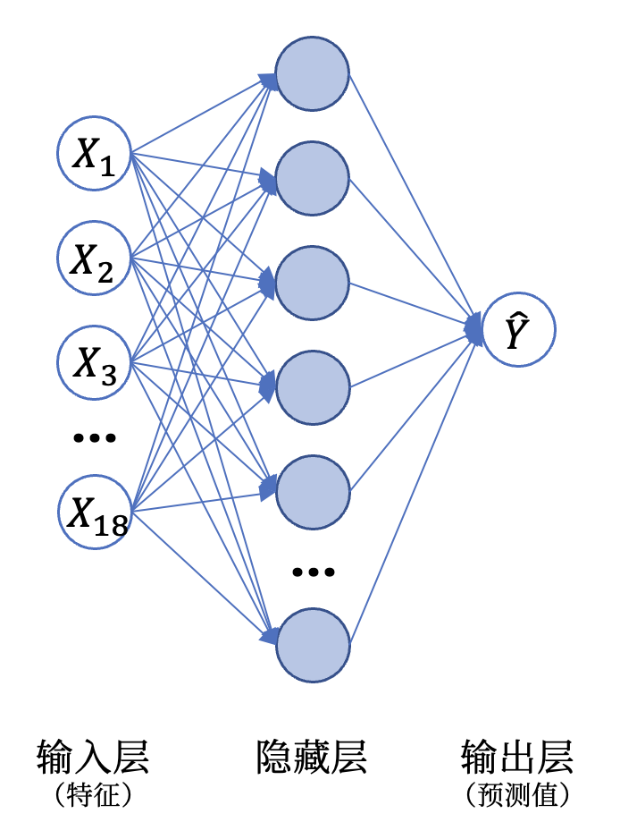

# 《成人死亡率预测》程序报告

<center>姓名&学号：沈韵沨，22460037</center>

<center>学院（系）&专业：工程师学院，电子信息</center>

<div style="page-break-after:always"></div>

## 1 算法流程

### 1.1 Training


<center>Figure 1: 训练流程图</center>

#### 1.1.1 数据预处理

​	通过 `pandas` 载入训练数据后，我们不难将训练特征分为两大类：

1. Categorial：'Country' & 'Status'
2. Numerical：其余的 19 个特征

##### 1 离群点检测与处理

​	基于箱线图（Box Plot）可视化 Numerical 类型特征分布（如 Figure 2 所示），可以看出源数据的多个特征中均存在离群点。





<center>Figure 2: 部分 Numerical 特征箱线图</center>

​	为此，我们借助 `winsorize` 对下列特征进行缩尾处理以降低异常值对预测结果的影响：

```python
# 需要进行缩尾处理的特征（17个）
cols_with_outliers = [
  'infant deaths', 'Alcohol', 'percentage expenditure',
  'Hepatitis B', 'Measles ', ' BMI ', 'under-five deaths ', 'Polio',
  'Total expenditure', 'Diphtheria ', ' HIV/AIDS', 'GDP', 'Population',
  ' thinness  1-19 years', ' thinness 5-9 years',
  'Income composition of resources', 'Schooling'
]
```

​	此处的 `winsorize` 处理屏蔽空值与无效值，进行 `10%`，`90%` 的缩尾处理：

```python
for col in cols_with_outliers:
	mask = df[col].notna()
  df.loc[mask, col] = winsorize(df[col].loc[mask], limits=(0.1, 0.1))
```

##### 2 空缺值处理

​	筛选存在空缺的特征（好在都是 Numerical 型）：

```python
cols_with_missing_val = list(df.columns[df.isnull().sum()>0])
# = ['Alcohol', 'Hepatitis B', ' BMI ', 'Polio', 'Total expenditure',
#    'Diphtheria ', 'GDP', 'Population', ' thinness  1-19 years',
#    ' thinness 5-9 years', 'Income composition of resources',
#    'Schooling']
```

​	此处借助 `SimpleImputer` 使用均值对各列特征进行填充：

```python
imputer = SimpleImputer(strategy='mean', missing_values=np.nan)
imputer = imputer.fit(data[column_name])
data[cols_with_missing_val] = imputer.transform(data[cols_with_missing_val])
```

##### 3 特征工程

​	由于本次实验选用多层感知机（MLP）作为回归预测模型，此处丢弃了不方便进行标准化的三个 Categorial 特征："Country", "Status", "Year"（剩下的就相信 MLP 拟合非线性关系的能力了）。但我们还是可以通过可视化分析这一操作的合理性：

> 虽然 "Year" 列的取值为整数，但其语义 “年份” 仍是 Categorial 的。

​	借助 Sklearn 提供的 `LabelEncoder`，将 Categorial 类编码为序数后可以得到如 Figure 3 所示的协方差下三角阵，不难看出：

- 三对特征（"under-five deaths" & "infant deaths"，"GDP" & "percentage expenditure"，"thinness  1-19 years" & "thinness 5-9 years"）间高度相关，其相关系数均超过 0.9。

  > 按理来说应该从中各挑一个特征删掉，但在模型初始参数固定的情况下模型表现更差了，故此保留。

- Caregorial 参数中："Country" & "Year" 与 “成人死亡率” 的相关系数极低，而 "Status" 与 “成人死亡率” 具有一定的相关性。



<center>Figure 3: 各特征及成人死亡率间的协方差三角阵</center>

---

​	下面进一步通过数据可视化手段对 Categorial 类特征进行分析：

- 移除 "Country" & "Year" 具备一定的合理性。

  如 Figure 4 所示，图中不同颜色的数据点具有相异的 “Country” 字段值，不难看出：

  成人死亡率在不同 "Year" 间的分布范围差异较小，且同色数据点在 Y 向上波动较大、成人死亡率与 "Country" 的关联度较低。



<center>Figure 4: 成人死亡率随年份变化趋势图（不同颜色代表不同国家）</center>

- "Status" 字段对与 “成人死亡率” 具有一定的相关性。

  如 Figure 5 所示，图中蓝色代表发展中国家（Developing）、黄色代表发达国家（Developed），不难看出：

  发展中国家往往具有更高的成人死亡率，而发达国家的成人死亡率普遍更低。这说明 "Status" 字段与 “成人死亡率” 相关，但两者的分布区间仍存在重叠、并不起决定性作用。



<center>Figure 5: 发展中/发达国家的成人死亡率直方分布图</center>

---

​	最终，本次拙劣的 Feature Engineering 仅拙劣的丢弃了 "Country"、 "Status"、 "Year" 三个字段。

##### 4 特征标准化

​	由于本次实验采用的 MLP 模型对特征缩放敏感，因此需要对输入特征进行标准化。借助 Sklearn 提供的 `StandardScaler`，可将所有 Numerical 标准化至标准正态分布（$\mu = 0, \sigma = 1$）。

​	相关参数将被序列化，以保证在测试阶段能以 <u>相同尺度</u> 对测试集进行缩放。

#### 1.1.2 模型选择

​	本次实验采用简单的多层感知机（MLP）进行回归预测，以期从给定特征中拟合非线性模型。

>  从而减少 Feature Engineering 的工作量

​	模型的总体结构如 Figure 6 所示，使用的超参数将于 2.2 节中进一步说明。



<center>Figure 6: 本次实验使用的 MLP 模型（只有一个隐藏层）</center>

### 1.2 Prediction

​	非常简单，就两步：

1. 预处理测试集特征 $\{X^m_i\}_{1 \leq i \leq 21, 1 \leq m \leq M}$，其中 $M$ 为训练集大小

   1. 丢弃特征 "Country"、 "Status"、 "Year" 
   2. 以与训练集相同的尺度对特征进行放缩，得到 $\{Normed\_X_{i'}^m\}_{1 \leq i' \leq 18, 1 \leq m \leq M}$

2. 将标准化处理后的特征输入 MLP 模型，得到预测结果 $\hat{Y}$：
   $$
   \hat{Y} = MLP(Normed\_X_{i'}),\ {1 \leq i' \leq 18,\ 1 \leq m \leq M}
   $$

<div style="page-break-after:always"></div>

## 2 实验分析

### 2.1 评估指标

​	为与 `main.ipynb` 中保持一致，本实验采用 均方误差（MSE）和 决定系数（R<sup>2</sup> Score）来评估该回归模型的性能。

​	鉴于 Sklearn 提供的 `MLPRegressor` 以平方误差（SE）作为损失函数，至少第一个指标十分合理。

### 2.2 模型优化

​	由于本次作业以 R<sup>2</sup> Score 作为赋分依据，因而以此作为调参优化目标。经试验发现，使用多层 MLP 模型存在过拟合嫌疑：

| 隐藏层          | 初始学习率 | 训练集 R<sup>2</sup> Score (x100) | 测试集 R<sup>2</sup> Score (x100) |
| --------------- | ---------- | --------------------------------- | --------------------------------- |
| `(25,)`         | 0.005      | 58.4                              | 40.9                              |
| `(32,)`         | 0.006      | 60.7                              | 63.9                              |
| `(64,)`         | 0.0005     | 70.0                              | 54.02                             |
| `(64, 32)`      | 0.01       | 89.0                              | 34.13                             |
| `(64, 32, 16)`  | 0.002      | 90.9                              | 40.9                              |
| `(64, 64, 64)`  | 0.0005     | 91.6                              | 35.54                             |
| `(128, 64, 64)` | 0.005      | 93.9                              | 30.36                             |

​	最终提交的模型设置如下：

|      参数      | 说明                                       |
| :------------: | ------------------------------------------ |
| 隐藏层神经元数 | `(32, )`，仅使用一层含 32 个神经元的隐藏层 |
|    激活函数    | ReLU                                       |
|    优化算法    | Adam                                       |
| L2 正则化参数  | 0.0001                                     |
|   初始学习率   | 0.006                                      |
|     批大小     | 200                                        |
|    随机种子    | `random_state = 1`                         |

<div style="page-break-after:always"></div>

## 参考文献

[1] Preprocessing data . https://scikit-learn.org/stable/modules/preprocessing.html

[2] 啥都不懂的鳄鱼. 【Python中应用Winsorize缩尾处理的心得】. https://blog.csdn.net/m0_53119847/article/details/122729777

[3] sklearn.neural_network.MLPRegressor . https://scikit-learn.org.cn/view/714.html