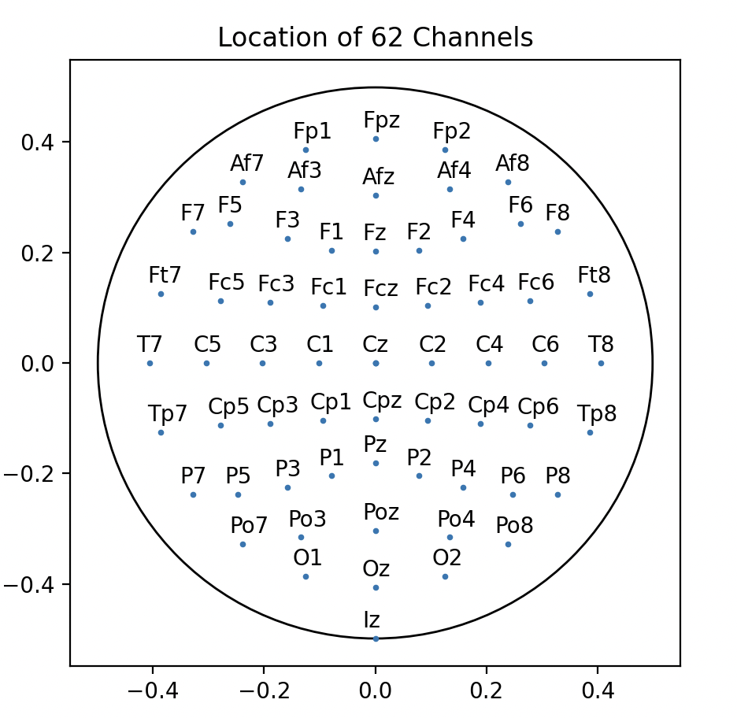
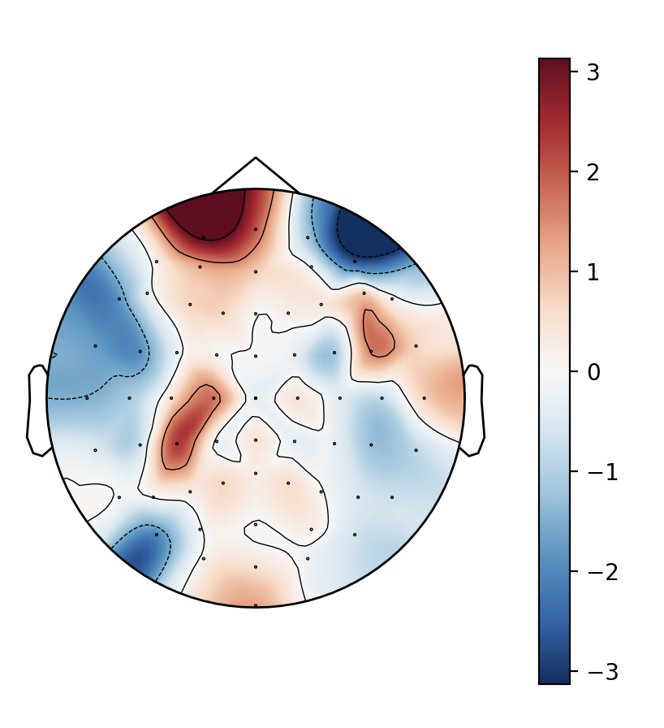
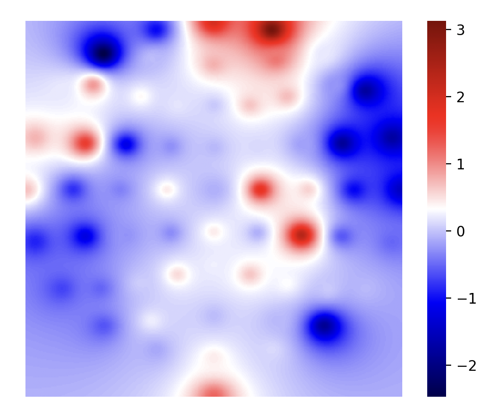
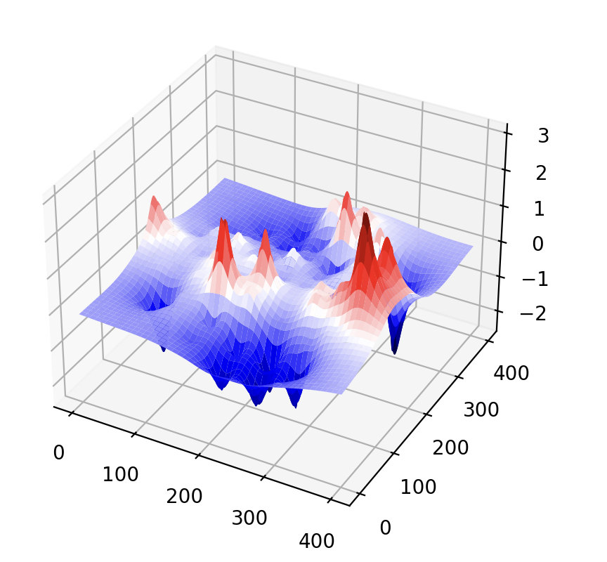
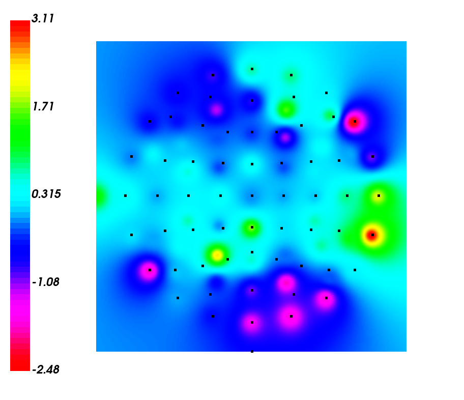

- 目前的效果

    - 仅显示电极位置
    
        

    - 基于 MNE 的 2D 可视化（纯调包，肯定不行）

        

    - 基于自己实现的 IDW 插值（就是平方反比的加权平均数）

      - 基于 Seaborn heatmap 的 2D 可视化
  
        

      - 基于 Seaborn 的 3D 可视化

        

        
下面是俯视图 -> 因为网格不均匀看起来怪怪的

        
        
      - 基于 VTK 的 2D 可视化（菜菜的，但是这个 API 真的抽象）

        - Bar 的颜色不太好调成 红-蓝 渐变orz
        - 是助教给的工具链
        - 糊好了等值线、糊好了裁切（但是没有切等值线 😂）
        

- 数据集来自 [GitHub 仓库](https://github.com/mastaneht/SPIS-Resting-State-Dataset)

    - 1-64 channels 
    - 68   channels = trigger {
        200: eyes open
        220: eye closed
    }

数据集采用 10-10 导联系统

- 电极分布来自 [BCI 竞赛](https://github.com/gmicros/MATLAB/blob/master/BCI%20Initial%20Assignment/eloc64.txt) 提供的极坐标

ref:

- 基于 MNE 包的 EEG 可视化：https://blog.csdn.net/qq_37566138/article/details/119646578

- 计算空间等值线：https://blog.csdn.net/lvxuesong/article/details/6113336

