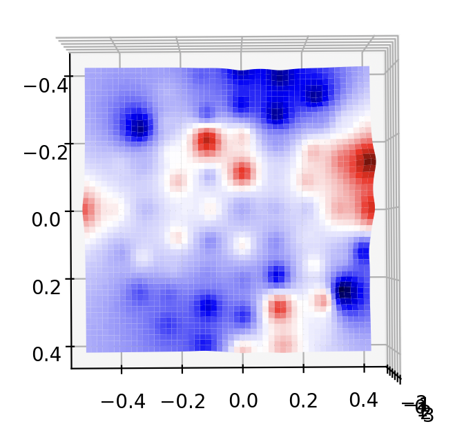

- 目前的效果

    - 仅显示电极位置（缺少 P9 & P10）

        - 电极分布来自 [BCI 竞赛](https://github.com/gmicros/MATLAB/blob/master/BCI%20Initial%20Assignment/eloc64.txt) 提供的极坐标

        - `./dataset/biosemi_64_besa_sph.besa` 是本数据集给出的标准位置，但 BESA 的标准既不是直角坐标、也不是极坐标（过于抽象了）
    
        

        本数据集采用了 10-10 导联标准：

        

    - 基于 MNE 的 2D 可视化（纯调包，肯定不行）

        

    - 基于自己实现的 IDW 插值（就是平方反比的加权平均数）

      - 基于 Seaborn heatmap 的 2D 可视化
  
        

      - 基于 Seaborn 的 3D 可视化

        

        
下面是俯视图 -> 因为网格不均匀看起来怪怪的

        
        
      - 基于 VTK 的 2D 可视化（菜菜的，但是这个 API 真的抽象）

        - Bar 的颜色不太好调成 红-蓝 渐变orz
        - 是助教给的工具链
        - 糊好了等值线、糊好了裁切（但是没有切等值线 😂）
        - 支持 Y 向拖动更改等值线取值
        

- 数据集（来自 [GitHub 仓库](https://github.com/mastaneht/SPIS-Resting-State-Dataset)）

  总共有 68 个纬度（从 1 开始编号），各维度数据含义如下：

    - 1-64 channels 
    - 68   channels = { 200: eyes open，220: eye closed}

        其实没必要 => 文件名已经写好了

- 一些参考：

  - 基于 MNE 包的 EEG 可视化：https://blog.csdn.net/qq_37566138/article/details/119646578

  - 计算空间等值线：https://blog.csdn.net/lvxuesong/article/details/6113336

  - Marching Squre：其实 vtk 自己就实现了 Marching Squre 算法（其实 Marching Cube 也有）

    Dame, 这里是一份 Python 的实现参考：https://github.com/Adam-Mazur/Marching-squares-python/blob/main/main.py

    但人家拿 openCV 画的，所以还是小小移植了一下